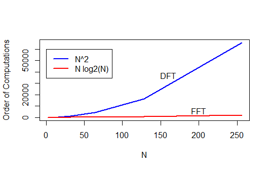

[](http://quantlet.de/index.php?p=info)

## [](http://quantlet.de/) **NIC_FFT_Comp** [](http://quantlet.de/d3/ia)

```yaml

Name of QuantLet : NIC_FFT_Comp

Published in : Numerical Introductory Course - Student Presentation on ''Fast Fourier Transform''

Description : 'Plots the order of computations of the Discrete Fourier Transform (DFT) and the Fast
Fourier Transform (FFT) as a function of the sample size.'

Keywords : DFT, FFT, run time, complexity, comparison, numerical methods

See also : NIC_FFTAlgorithm, NIC_FFTImageProcessing, NIC_FFTMAFilter

Author : Tim Radke

Submitted : 06.05.2016

Example : Plot of order of computations of DFT and FFT.

```




### R Code:
```r
NA
```
